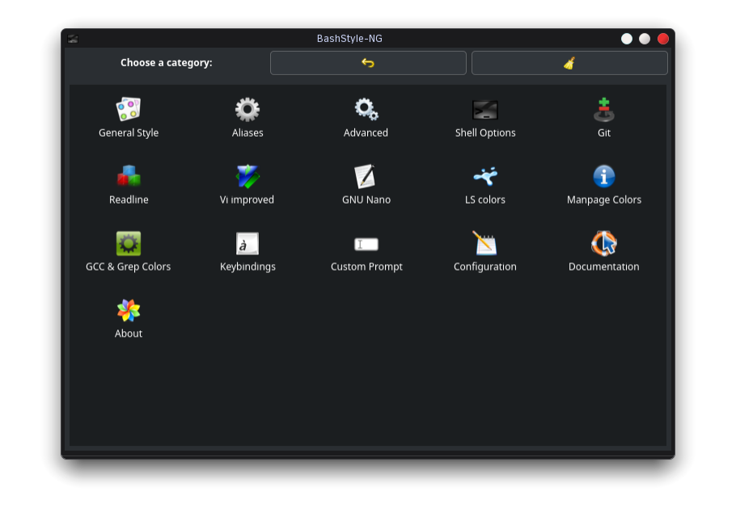
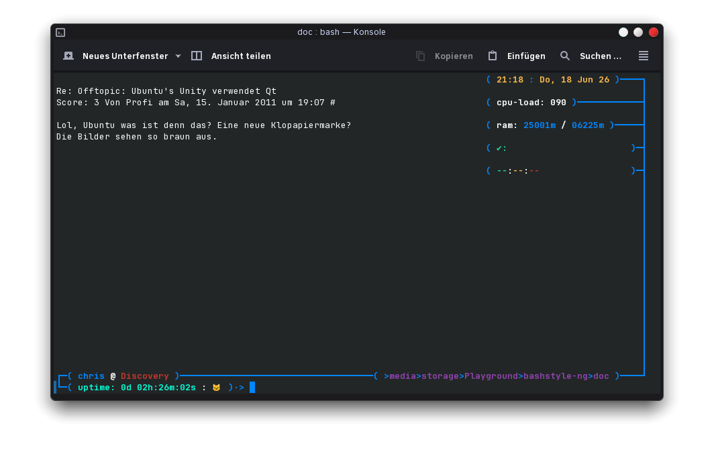

## 1 Introduction <a href="#Introduction" class="copiable-link">¶</a>

**BashStyle-NG** is a graphical utility and toolchain for changing the
look, feel, and behavior of `Bash`, `Readline`, `Vim`, `Nano`, and
`Git`. It acts as a central hub to add advanced features, configuration
and visual enhancements into standard command-line tools, making the
terminal environment more user-friendly and powerful.

**Figure 1.1:** BashStyle-NG main menu

The following is summary of possibilities, see the documentation for
more.

### Prompt Customization <a href="#Prompt-Customization" class="copiable-link">¶</a>

- **Prompt Styles:** Includes 12 pre-defined prompt designs which can be
  randomized per session or customized.
- **Custom Prompt Builder:** A modular prompt builder inside the GUI
  allows users to create their own custom prompt layouts, or modify the
  predefined styles.
- **Color Schemes:** Full control over text and prompt colors, with
  optional monochrome modes.

### Utility Enhancements <a href="#Utility-Enhancements" class="copiable-link">¶</a>

- **Colored Output:** Allows colored rendering for traditional manpages,
  `ls`, `gcc` error messages and `grep` matches.
- **Directory Tracking:** Features a custom `lscd`/`treecd` command that
  remembers the last visited directory, auto-restores directory on new
  session, and prints directory contents immediately after navigating.
- **Git Status Integration:** dynamically displays the current Git
  branch, revision, action, and more straight in the prompt.
- **History:** customize how many commands the shell remembers, ignores
  duplicate entries, and controls how history is written to disk. This
  includes the options for `history isolation` - meaning that terminal
  sessions have no outside visible history. Or the opposite
  `history sync`, when active, reloading the prompt (pressing enter),
  will load any new history created from other sessions.

### Configuration Management <a href="#Configuration-Management" class="copiable-link">¶</a>

- **BashStyle-NG** handles it’s own configuration through **ConfigObj**,
  all Text and Number settings have two icons. The left icon (back
  arrow) reverts to previously saved user configuration if a setting was
  changed in the running **BashStyle-NG** instance. The right icon
  (broom/trash) reverts to the factory default setting, which is either
  **BashStyle-NG** default setting or a custom vendor configuration,
  which can be provided by package maintainers.
- **BashStyle-NG** additionally has global revert buttons at the top,
  which act the same way, but for all settings at once, to keep the UI
  in sync it is restarted after the configuration was reverted to
  previous saved user state or factory default settings.

**Figure 1.2:** Equinox prompt style in Konsole

### Git repository access <a href="#Git-repository-access" class="copiable-link">¶</a>

You can check the latest version via **GitLab**:

<a href="https://gitlab.com/Nanolx/bashstyle-ng"
class="url">https://gitlab.com/Nanolx/bashstyle-ng</a>

### Translations <a href="#Translations" class="copiable-link">¶</a>

- Existing Translations \[Translator\]
  - de (German) \[Christopher Roy Bratušek\]

### Submit Bugs for Feature Requests <a href="#Submit-Bugs-for-Feature-Requests" class="copiable-link">¶</a>

Visit <a href="https://gitlab.com/Nanolx/bashstyle-ng/issues"
class="url">https://gitlab.com/Nanolx/bashstyle-ng/issues</a> for
reporting bugs.

Please make sure that you got the latest stable version of BashStyle-NG.
If you got an Feature Request or a new Idea for BashStyle-NG, don’t
hesitate to post it! If you can provide patches, then that’s even
better.

